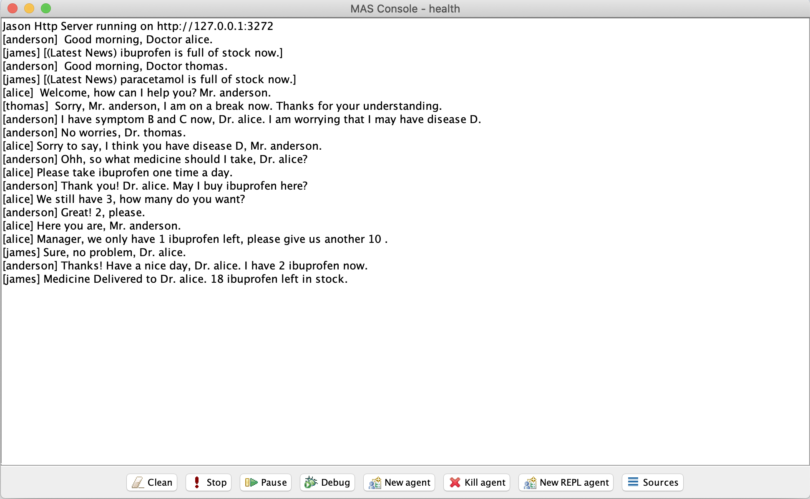

# MAS-Dignosis

This document describes the scenario of the multi-agent system, and the setup instructions.

## Scenario

In this scenario, there are 4 agents in all: one patient, two doctors and a medicine stock manager. The patient who has symptom(s) turns to see the doctors for medical advice and prescriptions. Doctors would make their diagnosis based on their knowledge. If the patient is confirmed to have disease, he can purchase the medicine on the prescriptions from the doctors, if the patient doesn’t have such medicine. Patient’s name is Anderson, Doctor A’s name is Alice, Doctor B’s name is Thomas, medicine stock manager’s name is James.

The global knowledge base for diagnosing is that there are symptoms A, B and C, and disease D. Dr. Alice believes that only patients have both symptoms A and B, who are infected with disease D; Dr. Thomas believes that if patients have symptom B, who are diagnosed as having disease D. Since the patient didn’t make an appointment, and there is only one doctor would work at a time (the other one is on the break), the patient may meet different doctors when visiting the clinic. Therefore, the conversation would continue between the patient and the doctor who is working at the moment. If the diagnosis is that the patient has the disease D, then the patient would ask the doctor(s) their prescriptions and purchase the medicine at the clinic. we assume that the patient would feel much better after purchasing. After the purchase, the doctors would ask the medicine stock manager for delivering more. At the beginning of the project, the manager checks the stock status and publish the information. If the amounts of medicine requirement from doctors don’t exceed that of stockpile, manager would deliver the required medicine to the doctors.

## Setup
### 1. Download and Decompress
    1.1. Download the "health.zip" file that contains all files of the project.

    1.2. Decompress it and move the folder to your jason environment directory.
         Please NOTE: the tree of the project directory should be like the following structure:
    
    ├── Readme.txt
    ├── bin
    │   ├── classes
    │   └── health.xml
    ├── health.mas2j
    └── src
        ├── asl
        │   ├── doctorA.asl
        │   ├── doctorB.asl
        │   ├── patient.asl
        │   └── stock_manager.asl
        └── java
    
### 2. Import the Project
    2.1. Open "Eclipse";
    
    2.2. Click "File", then choose "Open Projects from File System";
    
    2.3. Click "Directory", which is at the end of "Import source" bar;
    
    2.4. Select "health" folder in your workspace folder, whose names are "eclipse-workspace" in Mac OS and Windows;
    
    2.5. Tick the square before "health", click "Finish";

### 3. Run the Project
    3.1. After successfully import the project via Eclipse, select the "health" in the Jason Navigator bar, we may find that            there are 2 errors in the Problems tab, one of which's type is "Build Path Problem", right click it. Select the                "Quick Fix";
    
    3.2. Select "Configure build path...", then click "Finish";
    
    3.3. Select "Libraries" tab, remove MY library, in which case whose name starts with "jason-2.4.jar - ...";
    
    3.4. Switch to "Order and Export" tab, click "JRE System Library [jdk-version]" in Windows and in Mac OS. Click "Apply and          Close";
    
    3.5. Now, please feel free to run the project by clicking "Run Jason Application".

## Results

  

